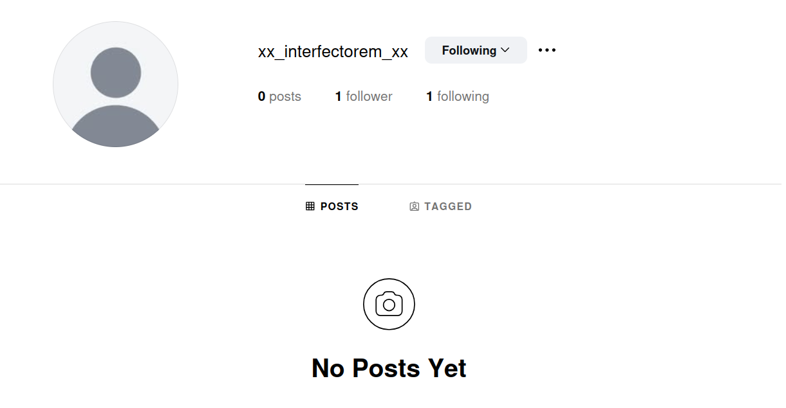
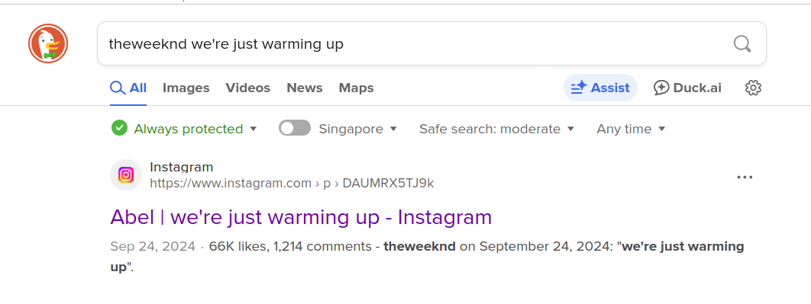
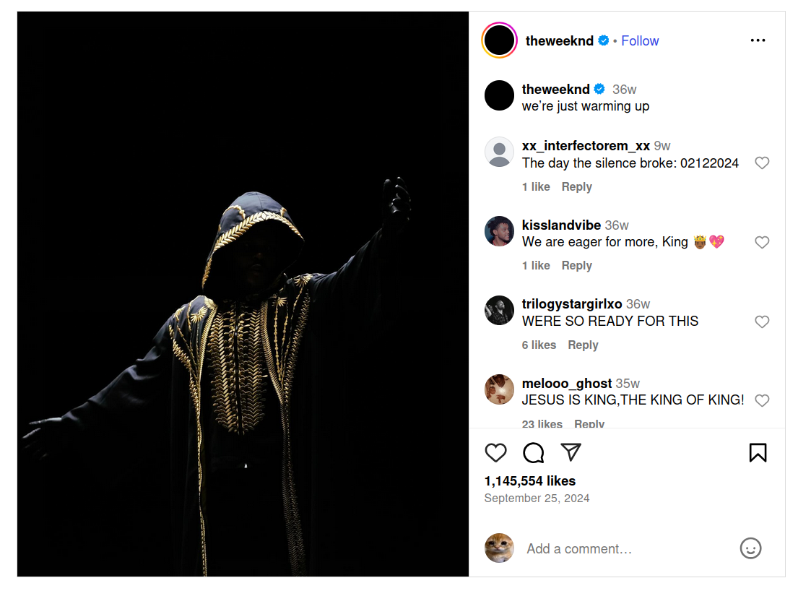

# Griffles City Killer
## Intended solve
`1.1` appears to be a blank PDF, but upon highlighting all (CTRL+A) we see that there is a table present with 6 columns. Noticing that the challenge description mentions the username being hidden in the PDF, and there are 19 rows, maybe each row contains 1 character of the username? We notice that the first column spells out `xx_interfectorem_xx` after converting binary to ASCII, checking on Instagram it leads to an account with no posts. Let's follow it first.

`2.1` is a seemingly innocuous image of [Port Louis Chinatown](https://en.wikipedia.org/wiki/Chinatowns_in_Africa), and metadata looks normal. Midway through the CTF, it was mentioned that a basic forensics Linux-CLI based tool was used to hide information, alternatively you can bash these tools or use Aperisolve to look through for anything suspicious. If we bash `strings` at the end...
> theweeknd we're just warming up

Upon Googling, we see it is an Instagram post.

There's a comment by `xx_interfectorem_xx` which is more obvious if you've followed the account, with the password to unlock the ZIP `3.1`, `02122024`.

Opening `devious.txt` and converting the binary to ASCII, then the first line, hex to ASCII, we get the killer's name: `victor_emery`. Hence, the flag is `grifflesCTF{victor_emery}`.

## Alternative solve
Given the information that the password is a date string of 8 characters, we can try brute forcing the ZIP file's password with some guesses. To narrow search space from all possible 8 digit combinations, we can add some constraints on day, month, year, and test out the different formattings: DDMMYYYY, MMDDYYYY etc.
Also, notably, the password may appear to work but fail, so we try reading the file each time to see if it's legitimate contents.

Python code in [passwordBruteForce.py](passwordBruteForce.py)