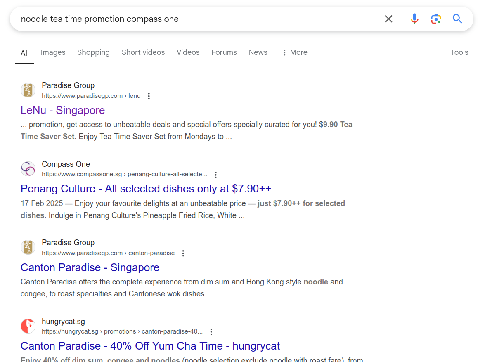

We should start by finding the noodle shop Tsukasa is referring to.
From the travellator extract, we see that it took 11 minutes from the mall's MRT to Serangoon. We know that it is Serangoon since (1) only one MRT line change (2) 6 mins from this station to Marymount (so clearly not Dhoby Ghaut) (3) has a travellator, which eliminates Botanic Gardens, Bishan and Caldecott. Some possible candidates for the mall may be Sengkang, Buangkok, Boon Keng and Farrer Park. Boon Keng MRT has no directly associated mall, so we can ignore it.
We can try Googling the malls associated with these stations for "noodle tea time promotions" -- we thus find the noodle shop, which is LeNu Noodle Bar.

How do we find Tsukasa's favourite pasta place, which seems completely unrelated? The trick is to look up reviews for LeNu (subtly hinted by "I wish more people would try it"). If we look it up on Google Maps and scroll through the reviews, or look up "dumpling" on the search bar, we find [a review](https://maps.app.goo.gl/AmWH31J5c5dFgo366) that matches Tsukasa's opinions on the food! (it also has a Tsukasa profile picture because Tsukasa is clearly a real person) We can eliminate the ones on spicy dumplings because he clearly fears the spicy dumplings.

It is now trivial to access Tsukasa's Google Maps profile and find his 5 star review of the pasta place, Momo Pasta (which is now unfortunately permanently closed 😿). Hence, the flag is `grifflesCTF{momopasta}`.

Note: Sengkang Grand Mall (Buangkok) also has a tea time promotion (Le Shrimp). But we can infer from "We should try the prawn variant at the other restaurant branch sometime too, there's one nearby." that this is the "other restaurant branch", so it's not the one in the mall they were in.