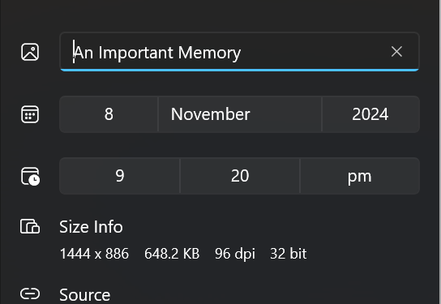
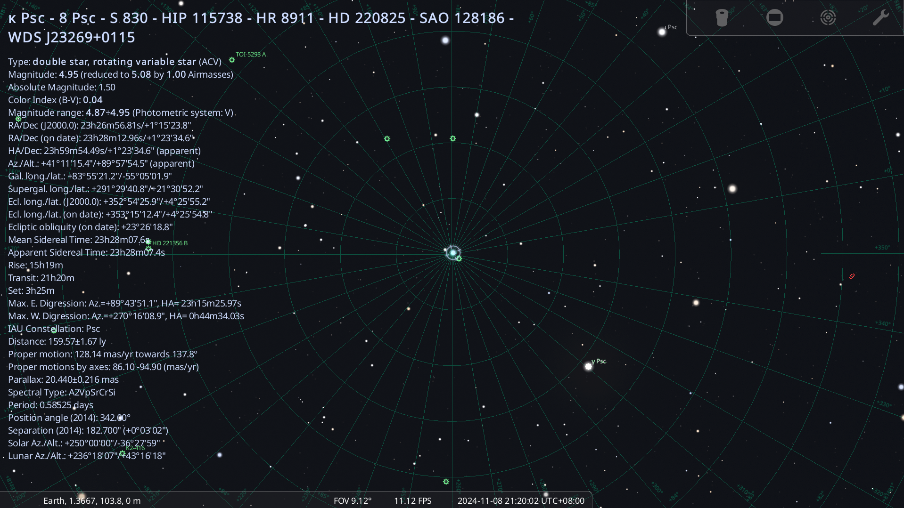
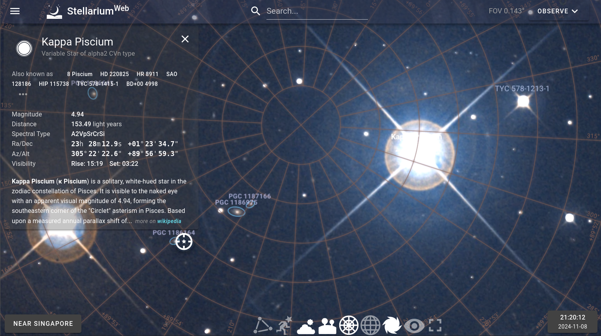
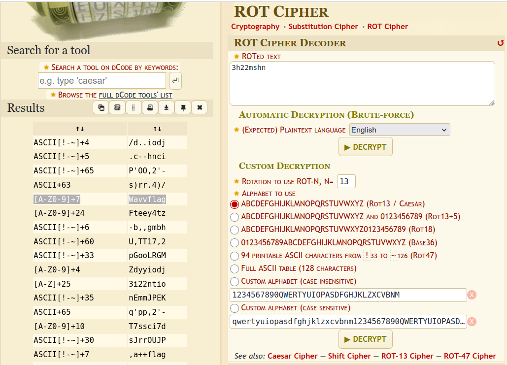

Check the info of the image attachment. You will see that the image was taken on 8 Nov 2024, at 9.20pm. 

Open Stellarium or any other stargazing app and change the date and time to the 08/11/2024, 21:20. Using the azimuth grid, find the zenith and enlarge until you see a star near the zenith (as hinted by the squint word in Astra's message). 

This is the Kappa Piscium star, it is a type of rotating variable star. 
From Abyss's message, you are hinted to look at the setting time of the star. In Stellarium, you can find this under the set attribute, giving you 3h25m. 
Add the verification code shn to get 3h25mshn and use ROT decode (as hinted by rotating variable star type) to obtain the flag "wavyflag". 

NOTE: Due to variance in star details based on location, additional details were released during the challenge regarding the coordinates to be used:
Near Singapore, Singapore
1.36390 103.83700

and the time given of 3h22m is slightly different, but you should still be able to get the final flag. ROT decode using dcode should work via the Brute Force tool to guess the final flag.

