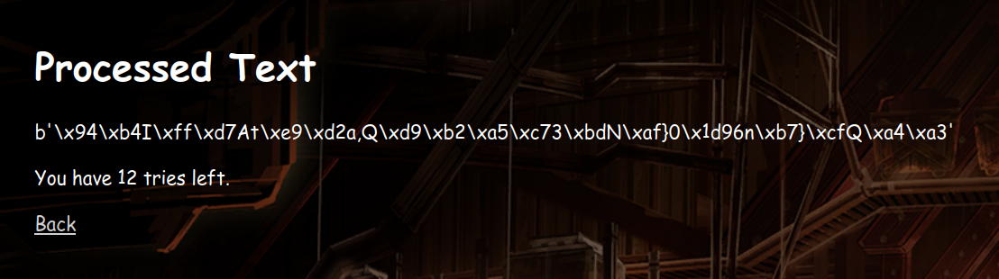

# Resources
[Paper detailing the exploit](https://eprint.iacr.org/2020/1491.pdf)
[AESGCM collision code](https://github.com/julialen/key_multicollision/blob/main/collide_gcm.sage)

# Method
Utilise a key partitioning oracle attack since AES-GCM is a non-committing encryption scheme, such that there are multiple ciphertexts that can decrypt successfully under a certain key.

When the key is within the keyset, we will get a valid decryption result and a status code of 200.

In this example, I got the result at the index 4, so I will take that keyset and split it into half, generating a ciphertext that decrypts under each half.

When it fails, it throws a dummy plaintext, but it is easily distinguishable from the real plaintext decrypted (if you have such a long ciphertext, it doesn't make sense for the plaintext to be so short). And it will also return an Error 500 if you want to justify it further.

Notice that once you start binary searching, it has to be in either keyset, so don't waste your tries on confirming, or you may run out of tries.

Finally, we get the correct key! And we can submit it to get the flag.

You can refer to the [notebook](AESGCM.ipynb) for the solution code, by running it on a [Sage Docker image](https://hub.docker.com/r/sagemath/sagemath). It's not automated to send the requests automatically, but if your solution does, good job!