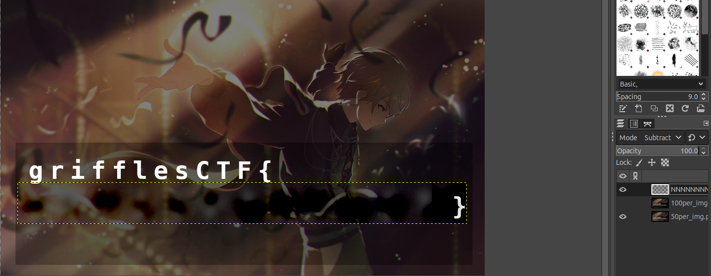

NOTE: All specifications are done in GIMP.

First, we want to identify the font details (size, family, spacing).
The size and family are easy to identify by overlaying the text.

Clearly, the spacing is wrong, but some overlaying on the blurred text tells us it is 45.0 (and consistent, given monospace font). We change the mode to Subtract so we can easily align the text, and use x as placeholder.

Now we can test out different combinations of characters. We can be more efficient by testing more frequent English characters first, and creating a table to collate the information on possible guesses.

String of all As:

The Gaussian blur effect with radius 11.5 has been applied as specified in the `challenge.yml` file. Any character with even a bit of distortion is ruled out to be an A, we can suspect that index 2 and 8 (0-index) is `A` since they are not distorted.

We should also cross-reference distortions between the 50% and 100% background variants. Let's take "N" as an example:

There are many indexes we cannot rule out given that they seem completely black. But if we use the 50% version:

It is much easier to notice that all indexes are distorted.

Repeating this process, we get the flag: `grifflesCTF{SHADOWPLAYER}` that completely obscures the text with the above method.

You can open the `.xcf` files in GIMP to view the layers.

Inspired by: https://bishopfox.com/blog/unredacter-winner and https://www.youtube.com/watch?v=Yi-Vea2AUEU
